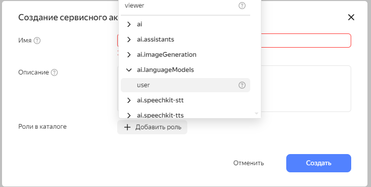
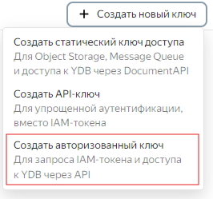
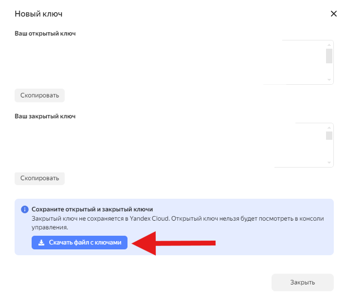

# Инструкция по запуску проекта

## Режимы запуска

### Режим разработки

1. Создайте файл `.env` по шаблону `.env.public`.
2. Внесите в него свои данные.
3. Для переменной `ENV` установите значение `dev`.

### Продакшен

1. Запишите в переменные окружения необходимые данные.
2. Для переменной `ENV` установите значение `prod`.

## Получение ключа сервисного аккаунта на YandexCloud

1. Перейдите в раздел "Сервисные аккаунты".
2. Создайте новый аккаунт и дайте ему роль: `ai.languageModels` -> `user`.
   
3. Перейдите в только что созданный сервисный аккаунт и выберите: "Создать новый ключ" -> "Создать авторизованный ключ".
   
4. После создания ключа будет предложено скачать JSON файл с ключом - скачайте его и закиньте в корень проекта (для другой локации необходимо поменять путь до файла в `main.py`).
   

## Установка зависимостей

```bash
pip install -r requirements.txt
```